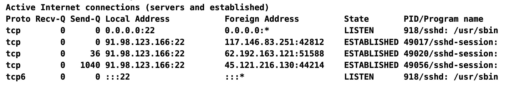

# Exercise: Setting up Virtual Machines (VMs) in the Cloud

## Prerequisites
- You should already have created a Virtual Machine

## Step 1: Connect to your VM

Use SSH to connect to your VM. You can find the public IP address of your VM in the cloud provider's dashboard.

```bash
ssh root@VM_IP_ADDRESS
```
> Replace `VM_IP_ADDRESS` with the actual IP address of your VM.

Verify that you are connected to the VM by checking the hostname:

```bash
hostname
```

## Step 2: Update the system

Before installing any software, it's a good practice to update the package lists and upgrade the installed packages:

```bash
sudo apt update
```
This command updates the package lists for upgrades and new packages. After that, you can upgrade the installed packages:

```bash
sudo apt upgrade -y
```
This command upgrades all the installed packages to their latest versions. The `-y` flag automatically answers "yes" to any prompts during the upgrade process.

Updating the system ensures that you have the latest security patches and software updates, which is crucial for maintaining the security and performance of your VM.

**Update time zone**
To set the correct time zone on your VM, you can use the `timedatectl` command. First, list the available time zones:

```bash
timedatectl
```

Then, set the desired time zone (replace `Your/Timezone` with the appropriate time zone):

```bash
sudo timedatectl set-timezone Europe/Copenhagen
```
## Step 3: Install packages
Now that your system is updated, you can perform basic Linux administration tasks such as installing software, managing services, and monitoring system resources.

To install a software package, use the `apt install` command. For example, to install `pwgen`, run:

```bash
sudo apt install pwgen net-tools -y
```
This command installs the `pwgen` and `net-tools` packages, which are a password generator and network tools respectively.

To check the location of an installed package, you can use the `which` command:

```bash
which pwgen
```
This command will show the path to the `pwgen` executable, confirming that it is installed correctly.

## Step 4: Managing processes

The simplest way to check if a server is doing well is to check the running processes. You can use the `htop` command to view a real-time list of running processes and their resource usage:

```bash
htop
```
> To exit `htop`, press `q`.

This shows you the CPU and memory usage of each process, as well as other details such as the process ID (PID) and the command that started the process. You can use the arrow keys to navigate through the list of processes.

Each process has a unique PID. If you want to stop a process, you can use the `kill` command followed by the PID of the process you want to stop. For example, if you want to stop a process with PID 1234, you would run:

```bash
kill -9 1234
```
> This command forces the process to stop immediately. Use this command with caution, as it does not allow the process to clean up resources or save its state before exiting.

You can also use the `ps` command to view a snapshot of the current processes. For example, to view all running processes, you can run:

```bash
ps aux
```
> This command lists all running processes along with their details such as the user, PID, CPU and memory usage, and the command that started the process.

The options used in the `ps aux` command are:
- `a`: Show processes for all users.
- `u`: Display the process's user/owner.
- `x`: Show processes that do not have a controlling terminal for the current user.
- `f`: Show a full-format listing, which shows the hierarchical relationship between processes (i.e. which processes have been started by which other processes).

## Step 5: Monitoring network connections
You can monitor network connections using the `netstat` command. This command shows you all active network connections and their associated processes. To use `netstat`, run:

```bash
netstat -atlpn
```
> The options used in the `netstat -atlpn` command are:
- `a`: Show all active connections and listening ports.
- `t`: Show TCP connections.
- `l`: Show only listening ports.
- `p`: Show the PID and name of the program to which each socket belongs.
- `n`: Show numerical addresses instead of resolving hostnames.



In this example, we can see that the program `sshd` (which is the SSH process) is listening on port 22 for incoming connections (the Local Address column shows `0.0.0.0:22`). This means that the SSH service is running and ready to accept connections on port 22. Furthermore, we can see three different connections to the SSH service from different IP addresses (the Foreign Address column shows the IP addresses of the clients that are connected to the SSH service). This indicates that there are currently three active SSH sessions on the server.